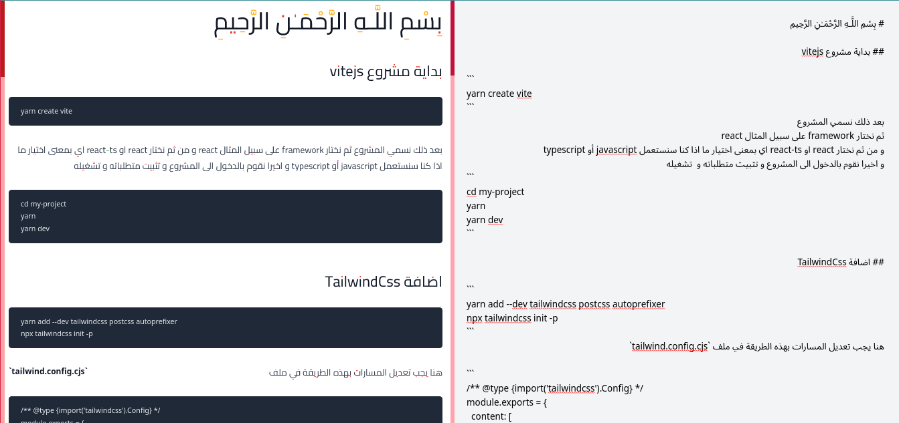

<h1 align="center">السلام عليكم  👋, أنا عبد الرحمان </h1>

 <p align="right">:fire: ماركداون بالعربي ادات جديدة رائعة لاخذ الملاحظات و تصميمها جميل </p>



 <p align="right"> <strong> طريقة الاستعمال </strong> </p>

```
git clone https://github.com/abdurahman-ghazi/markdown-arabic-vue
cd markdown-arabic-vue
yarn
yarn dev
```


<h3 align="right">الادوات المستخدمة</h3>
<p align="right"> <a href="https://www.w3schools.com/css/" target="_blank" rel="noreferrer">  </a> <a href="https://developer.mozilla.org/en-US/docs/Web/JavaScript" target="_blank" rel="noreferrer">  </a> <a href="https://vuejs.org/" target="_blank" rel="noreferrer">  </a> <a href="https://tailwindcss.com/" target="_blank" rel="noreferrer">  </a> </p>


